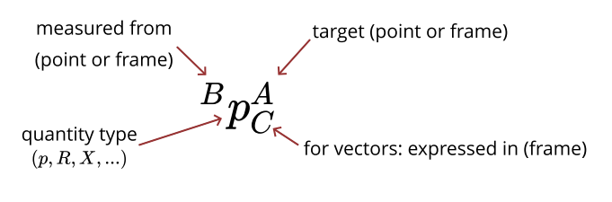

# EI-Beginner笔记1 - Pick and Place with Traditional Robotics

本节内容参考*Robotics Manipulation*的第三章，*Basic Pick and Place*，主要目的是搞明白`pybullet.calculateInverseKinematics`背后的算法。

## 1. 符号标记

为了方便说明与规范，必须先定义好一套符号。这里作者规定了一套非常奇怪而繁琐的记号，不过他保证这是必要且耐用的，让我们先往下看。

在Pick and Place的场景下，想象我们需要表示立方体（的质心）的**位置(position)**。首先，为了表示这是立方体$C$的位置，将其记为$p^C$。其次，相比于单个点的位置，我们一般更关心从另一点（比如夹爪的质心）测量，到这一点的位置（也就是相对位置或者位移）。将从点$A$测量，到点$C$的位置记为$^Ap^C$。

然而，一个位置必须明确在哪一个**坐标系(frame)**中表示，比如同样是夹爪到立方体的位移，在世界坐标系中可能是$(0, 3, -4)$，但在夹爪的体坐标系下可能就是$(5, 0, 0)$。为了明确位移在何种坐标系下表示，在$^Ap^C$的右下角增加一个表示坐标系的符号$F$，于是$^Ap^C_F$就表示坐标系$F$中，从点$A$测量，到点$C$的位置。

除了一般的坐标系$F$，存在两个特殊的坐标系。世界坐标系用$W$表示，想象一个小车，世界坐标系的$x$轴指向小车前方，$y$轴指向小车左方，$z$轴指向小车上方。体坐标系用$B_i$表示，在多体系统中，每一个物体都固连这一个坐标系，$B_i$就表示固连在第$i$个物体上的体坐标系。

一个坐标系可以由一个位置矢量加一个旋转矩阵完全确定。想象如何将一个坐标系从世界坐标系**变换(transform)**到夹爪体坐标系：首先将坐标系的原点从世界坐标系的原点平移到夹爪的质心，然后旋转三个坐标轴，使它们与夹爪体坐标系的三个坐标轴重合。用$R$表示**旋转(rotation)**，用$X$表示一个位置（矢量）加一个旋转（矩阵）的组合，称为**位姿(pose)**。$^BR^A$就在$B$坐标系中测量，$A$坐标系的旋转角度，$^BX^A$表示，在$B$坐标系中测量，$A$坐标系的位姿。

特别地，如果从坐标系$F$的原点出发测量一点$A$的位置，表示为$^Fp^A_F$，这是可以简写为$^Fp^A$；如果这个坐标系恰好又是世界坐标系$W$，表示为$^Wp^A_W$，就可简写为$p^A$。

> 个人感觉“从xxx出发测量，yyy的位置/旋转/位姿”挺拗口的，可以把它理解成点$A$到点$B$的位移、坐标系$G$到坐标系$F$的旋转/位姿，或者点$B$相对于点$A$的位置、坐标系$F$相对于坐标系$G$的旋转/位姿，可能更通顺（但没那么严谨）一点。

## 2. 空间代数

几个基本性质：

1. 在相同坐标系中的位置相加：
$$
^Ap^B_F+^Bp^C_F=^Ap^C_F$$
这很好理解，想象小车从$A$点出发，先走$B$相对于$A$的位移，到达了$B$点，再走$C$相对于$B$的位移，显然应该到达$C$点。
2. 位置相加的逆（减法）：
$$
^Ap^B_F=-^Bp^A_F
$$
3. 仅通过旋转即可改变位置所在的坐标系：
$$
^Ap^B_F\ ^FR^G=^Ap^B_G
$$
也很直观，一个在坐标系$F$中的距离矢量，右乘上一个“坐标系$F$到坐标系$G$”的旋转$^FR^G$，就变成了坐标系$G$中的距离矢量。
4. 旋转矩阵相乘：
$$
^AR^B\ ^BR^C=^AR^C
$$
5. 旋转矩阵相乘的逆：
$$
\left[^AR^B\right]^{-1}=^BR^A
$$
由于一个旋转矩阵必是正交阵，因此$R^{-1}=R^\text T$
6. 与旋转类似，对于空间变换有：
$$
^Fp^A\  ^FX^G=^Gp^A
$$
由于出发点变了（从$F$到$G$，因此仅靠旋转不够了，得用整个变换，即加上平移）。说明：
$$
^Gp^A=^Gp^F+^Fp^A_G=^Fp^A\ ^FR^G-^Fp^G
$$
说明将$F$坐标系下点$A$的位置变换到$G$坐标系下点$A$的位置，就是先右乘$F$坐标系到$G$坐标系的旋转矩阵，再减去$F$坐标系下$G$坐标系原点的位置。
7. 变换“相乘”：
$$
^AX^B\ ^BX^C=^AX^C
$$
8. 变换“相乘”的逆：
$$
\left[^AX^B\right]^{-1}=^BX^A
$$

> 旋转矩阵写在矩阵或矢量的左边或右边表示左乘或右乘是没问题的，但是变换看起来写得和左右乘一样，实际上却并不是乘法，只是“作用于”。要推导的时候可以把变换拆成乘法与加法。

### 例2.1 从相机坐标系到世界坐标系

假设实验台上固定一位姿固定的深度相机，相机坐标系为$C$，它的位姿可以用一个世界坐标系中的变换$^WX^C$表示。深度相机返回的点$P_i,i=1,2,..$是在相机坐标系中的，位置表示为$^Cp^{P_i},i=1,2,..$，为了将这些点转换到世界坐标系，只需：
$$
p^{P_i}=^Cp^{P_i}\ ^CX^W
$$
$^CX^W$就是**相机外参**，左乘时将世界坐标映射到相机坐标系坐标；右乘时将相机坐标系坐标映射成世界坐标。

### 2.1 如何表示3D旋转

一个物体在三维空间中的方向有多种表示方法，除了前面一直在使用的**旋转矩阵**，**还有欧拉角(Euler Angles)**，**横滚-俯仰-偏航角(Roll-Pitch-Yaw/RPY)**，以及**四元数(Quaternion)/欧拉参数(Euler Parameters)**。

旋转矩阵是一个3x3的正交阵，考虑一个参考坐标系$F$与一个目标坐标系$G$，则从$F$到$G$的旋转矩阵$^FR^G$描述了在参考坐标系$F$内目标坐标系$G$的姿态。取$^FR^G$的第一列，就是$G$的$x$轴方向单位向量在$F$中的表示；取$^FR^G$的第二列，就是$G$的$y$轴方向单位向量在$F$中的表示；取$^FR^G$的第三列，就是$G$的$z$轴方向单位向量在$F$中的表示。无论是欧拉角，RPY角，还是四元数，都可以转化成旋转矩阵。

欧拉角指**绕着物体自身坐标系的坐标轴**进行三次连续旋转，例如，$Z-Y-X$欧拉角表示：先绕物体当前的$z$轴旋转$\alpha$，再绕旋转后的新$y$轴旋转$\beta$，最后绕最新的$x$轴旋转$\gamma$。最终的旋转矩阵是三个基本旋转矩阵的乘积：

$$
R(\alpha,\beta,\gamma)=R_z(\alpha)R_y(\beta)R_x(\gamma)
$$

横滚-俯仰-偏航角指**绕固定参考坐标系的坐标轴**进行三次连续旋转，例如$X-Y-Z$RPY角表示：先绕固定的$X$轴（横滚轴）旋转$\gamma$，再绕固定的$Y$轴（俯仰轴）旋转$\beta$，最后绕固定的$Z$轴（偏航轴）旋转$\alpha$，数学表达为：

$$
R_{RPY}(\alpha,\beta,\gamma)=R_z(\alpha)R_y(\beta)R_x(\gamma)
$$

可以发现，绕固定轴$X\rightarrow Y\rightarrow Z$与绕物体轴$z\rightarrow y\rightarrow z$得到的矩阵**完全相同**，这是因为当绕固定轴旋转时，新的旋转矩阵要**左乘**在旧矩阵上，而当绕当前移动坐标系旋转时，新的旋转矩阵要**右乘**在旧矩阵上。

无论是欧拉角还是RPY角，都存在**万向节死锁(Gimbal Lock)**的问题，即当$\beta=\pi/2$时，出现自由度丢失。以欧拉角为例，当第一个旋转轴($z$)不变，第二个旋转轴($y$)旋转$90^\circ$，带动整个坐标系旋转$90^\circ$，这时第三个旋转轴($x$)就被转到了和第一个旋转轴重合或反向重合的位置，此时绕新$x$轴旋转与绕原本的$z$轴旋转，物理效果是完全相同的，系统虽然有三个轴，但其中两个轴重合了，我们失去了一个维度的控制能力。对于RPY角来说，因为旋转轴是固定不变的，不会有转轴重合的问题，但当$\beta=\pi/2$时，仍会导致数学上的奇异性，最终矩阵中的元素不再包含单独的$\alpha$或$\beta$，而是只包含它们的和或差，同样失去了一个维度的控制能力。

为了解决欧拉角与RPY角的奇异性问题，引入了使用四个参数的表示法，通常称为欧拉参数，在数学上等同于单位四元数，这一表示方法基于**欧拉旋转定理**：任何三维旋转都可以表示为绕通过原点的某个固定轴（单位向量$\hat\omega$）旋转一个角度$\theta$。

四元数由四个实数组成，通常写为$\boldsymbol q=(q_0,q_1,q_2,q_3)$或$\boldsymbol q=(\lambda_0,\lambda_1,\lambda_2,\lambda_3)$，包含一个标量部分和一个矢量部分：

$$
q_0=\cos(\theta/2)
\\
\begin{bmatrix}
q_1\\q_2\\q_3
\end{bmatrix}=\hat\omega \sin(\theta/2)
$$

四元数在全空间内平滑且无奇异点，完美解决了欧拉角或RPY角的问题。通过**罗德里格斯旋转公式(Rodrigues' Formula)**，可以建立四元数与三维旋转矩阵的直接映射：

$$
R(\boldsymbol q)=\begin{bmatrix}
2(q_0^2 + q_1^2) - 1 & 2(q_1 q_2 - q_0 q_3) & 2(q_1 q_3 + q_0 q_2) \\
2(q_1 q_2 + q_0 q_3) & 2(q_0^2 + q_2^2) - 1 & 2(q_2 q_3 - q_0 q_1) \\
2(q_1 q_3 - q_0 q_2) & 2(q_2 q_3 + q_0 q_1) & 2(q_0^2 + q_3^2) - 1 
\end{bmatrix}
$$

> 作者在本书中没有给矢量加\boldsymbol{}的习惯（比如位置虽然是矢量，但仍写成普通的$p$），但在我自己补充的部分，如四元数以及后面的控制理论部分，我会按照自己的习惯给矢量加粗加斜体。

## 3. 控制理论

在控制理论中，我们首先定义**状态(state)**$\boldsymbol x$、**控制(control)**$\boldsymbol u$和**量测(measurement)**$\boldsymbol y$。整个系统建模为：

$$
\dot{\boldsymbol x}=\boldsymbol f(\boldsymbol x, \boldsymbol u) \\
\boldsymbol y=\boldsymbol h(\boldsymbol x, \boldsymbol u)
$$

$\dot{\boldsymbol x}=\boldsymbol f(\boldsymbol x, \boldsymbol u)$称为**状态方程**，描述系统如何变化，$\boldsymbol y=\boldsymbol h(\boldsymbol x, \boldsymbol u)$称为观测方程，描述观测量$\boldsymbol y$与系统和控制的关系。

在robotics的视角下，一个拥有$n$个关节的机械臂的状态可以完全由**广义位置(configuration)**$\boldsymbol q$和**广义速度(generalized velocity)**$\boldsymbol v$表示，也就是：
$$
\boldsymbol x=\begin{bmatrix}\boldsymbol q\\\boldsymbol v\end{bmatrix}
$$

对于固定基座的机械臂，通常$\dot{\boldsymbol q}\equiv\boldsymbol v$，但是在浮动基座或更复杂的动力学中，$\boldsymbol v$可能是准速度，不等于$\dot{\boldsymbol q}$。有时$\dot{\boldsymbol q}$与$\boldsymbol v$的维度都可以不一样。

#### 1. 正运动学 (Forward Kinematics)
在控制理论的视角里，正运动学就是观测方程 $\boldsymbol y=\boldsymbol h(\boldsymbol x)$ 的具体化：给定广义位置 $\boldsymbol q$，求末端执行器（或任意刚体）的世界系位姿 $X^G$。记作 $X^G=f_{\text{kin}}(\boldsymbol q)$。现代引擎（如 Drake）用运动学树而不是单一串联链条来建模机器人，树根通常是世界系 $W$，树叶可能是夹爪 $G$。沿着从根到叶的关节依次右乘变换，就能得到末端位姿，例如在一条链上有节点 $B_0=W,B_1,\dots,B_k=G$ 时，有
$$
{}^WX^{B_k} = {}^WX^{B_0}\prod_{i=1}^{k} {}^{B_{i-1}}X^{B_i}(\boldsymbol q_i).
$$
如果已知任意中间刚体的姿态，也可以自顶向下或自底向上递推到其他节点（只是惯例上从世界系出发，因为各物体的姿态多半在世界系中给出）。

#### 2. 微分运动学 (Differential Kinematics)
微分运动学是观测方程的线性化，关注“微小的 $\mathrm d\boldsymbol x$ 会让输出 $\mathrm d\boldsymbol y$ 如何变化”。用 6 维空间速度（twist）$\boldsymbol V=[\boldsymbol\omega;\boldsymbol v]$ 同时描述角速度和线速度，雅可比 $J(\boldsymbol q)$ 则把广义速度映射到空间速度：$\boldsymbol V=J(\boldsymbol q)\,\boldsymbol v$。需要注意的是，广义速度 $\boldsymbol v$ 不一定等于 $\dot{\boldsymbol q}$。在固定基座机械臂里常常有 $\boldsymbol v=\dot{\boldsymbol q}$，但在浮动基座系统中，姿态可能用单位四元数（4 维），角速度是 3 维，此时 $\dot{\boldsymbol q}$ 的维度（例如 7）与 $\boldsymbol v$（例如 6）并不匹配，因此必须把 $\dot{\boldsymbol q}$ 通过坐标变换映射到广义速度空间。

#### 3. 微分逆运动学 (Differential Inverse Kinematics)
从正运动学的线性关系 $\boldsymbol V=J(\boldsymbol q)\boldsymbol v$ 出发，如果 $J$ 是方阵且可逆，最直观的想法就是左右乘一个 $J^{-1}$ 得到 $\boldsymbol v=J^{-1}\boldsymbol V$。现实里 $J$ 往往是非方阵（冗余机器人时列多于行，欠驱动时行多于列），或者在某些姿态下秩亏，常规逆不存在，于是就要用“最像逆”的摩尔–彭若斯伪逆 $J^+$。其定义可以通过奇异值分解写清楚：若 $J=U\Sigma V^{\text T}$，其中 $\Sigma=\operatorname{diag}(\sigma_1,\dots,\sigma_r)$，则
$$
J^+=V\,\Sigma^+U^{\text T},\quad \Sigma^+=\operatorname{diag}\!\left(\tfrac1{\sigma_1},\dots,\tfrac1{\sigma_r}\right),
$$
把非零奇异值倒过来再转置回来就是伪逆。代回微分 IK 得到 $\boldsymbol v=J^+\boldsymbol V_{\text{desired}}$，这是在所有可行解中 2-范数最小的关节速度，也就是“动得最少”的那一个。若 $J$ 秩下降，某些 $\sigma_i\to 0$ 会让 $1/\sigma_i$ 爆炸，对应的关节速度需求会发散，这正是奇异位形；常见的缓解是提前监控最小奇异值、在伪逆里做阻尼（damped least squares），或在前述带约束 QP 的框架里加入退避目标。

#### 4. 带约束的微分逆运动学 (Differential IK with Constraints)
简单的伪逆不能显式处理速度、位置或加速度的硬约束，因此更稳健的方式是把每一小步的微分 IK 写成一个二次规划：
$$
\min_{\boldsymbol v}\ \lVert J(\boldsymbol q)\boldsymbol v-\boldsymbol V_{\text{desired}}\rVert^2,
$$
并在同一个 QP 里加入 $\boldsymbol v_{\min}\le \boldsymbol v\le \boldsymbol v_{\max}$ 等线性约束。利用时间步长 $h$，还可以把位置限制改写成 $ \boldsymbol q_{\min}\le \boldsymbol q+h\boldsymbol v \le \boldsymbol q_{\max}$，或把加速度限制写成对 $\boldsymbol v$ 的不等式。若机器人是冗余的，可以在目标函数添加零空间次级目标，例如关节居中：增加 $\epsilon\lVert P(\boldsymbol v-K(\boldsymbol q_0-\boldsymbol q))\rVert^2$，其中 $P$ 是零空间投影矩阵，$K$ 是拉回标称位置 $\boldsymbol q_0$ 的增益。解得的 $\boldsymbol v$ 通过显式积分如 $\boldsymbol q_{k+1}=\boldsymbol q_k+h\boldsymbol v$ 不断滚动推进控制循环。

#### 5. 控制理论视角 (Control Theory Perspective)
用控制理论的语言，把状态写成 $\boldsymbol x=[\boldsymbol q;\boldsymbol v]$，正运动学就是观测方程 $\boldsymbol y=\boldsymbol h(\boldsymbol x)$，而正动力学是状态方程 $\dot{\boldsymbol x}=\boldsymbol f(\boldsymbol x,\boldsymbol u)$，其中 $\boldsymbol u$ 是关节力矩。逆运动学（含微分 IK）对应“逆观测”问题：给定期望输出 $\boldsymbol y$ 或 $\dot{\boldsymbol y}$，找合适的 $\boldsymbol x$ 或 $\dot{\boldsymbol x}$；逆动力学则是“逆状态演化”问题：给定期望的状态导数，求需要的控制输入。无论求解几何约束还是动力学约束，现代做法越来越倾向于把它们统一到约束优化的框架下，通过显式约束和目标项同时满足物理限制与任务需求。